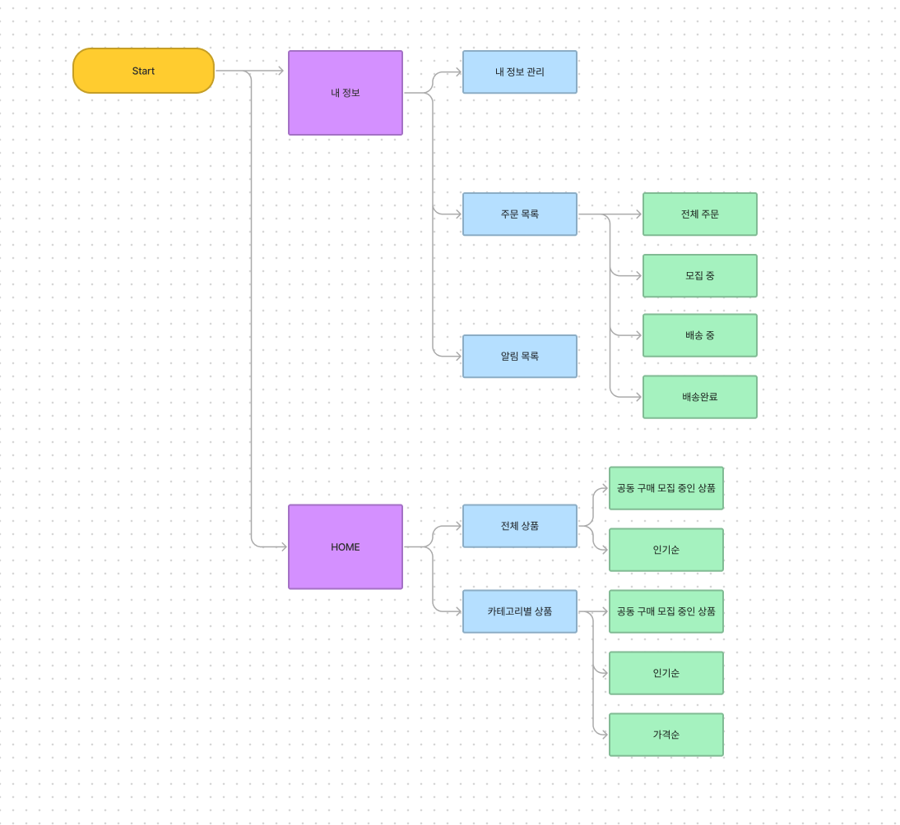
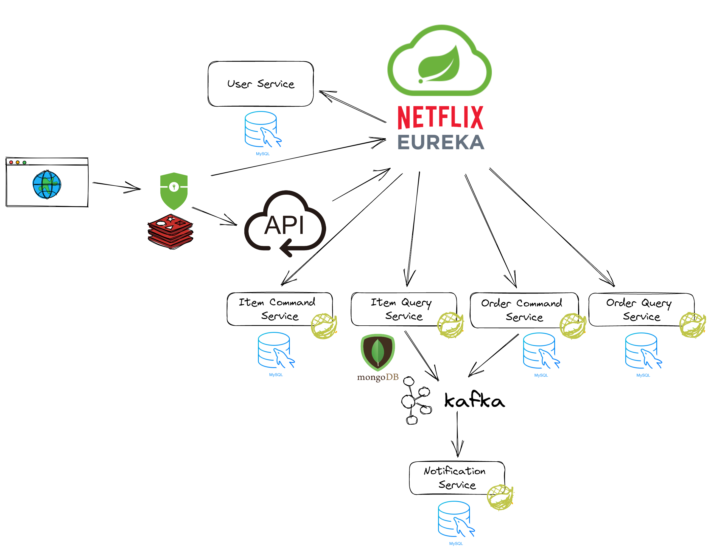
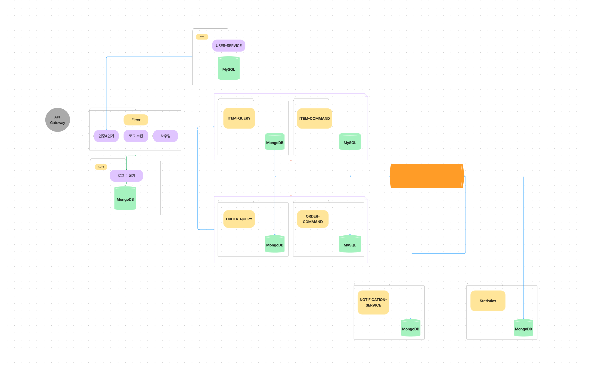

# Air Mart

## 사용 기술 스택
- Java 11+
- Spring Boot
- Spring Cloud
- Spring Security
- Spring Batch 
- JPA
- Docker
- Docker Compose
- MySQL
- Redis
- Kafka

## Air Mart 서비스 소개
간단하지만 강력한 공동 구매 마켓입니다. 판매자는 목표하는 묶음 개수의 상품을 등록하면, 소비자는 묶음 개수 단위로 구매할 수 있습니다. 
묶음 개수를 혼자 감당하기 힘들다면 즉석으로 다른 사람과 공동 구매를 할 팀을 구성할 수 있습니다.

## [Workflow](./workflow/README.md)

## ERD

## Software Architecture

## Service Concept Architecture

## Micro Service Info
|Micro Service Name|URI(Prefix)|Local Webserver Port|Occupied Port|
|:---|:---|:---|:---|
|Order Command Service|`/orders/**`, Http Method - `POST`,`PUT`,`DELETE` |9100|MySQL:3307|
|Order Query Service|`/orders/**`, Http Method - `GET`|9100|MySQL:3307|
|Item Service|`/items/**`|8081|MySQL:3306, MongoDB:27017|
|Joo Notification Service|`/jooi/noti/**`|8082|MySQL:3308|

## [Convention](./docs/convention.md)

## Issue & Solution
